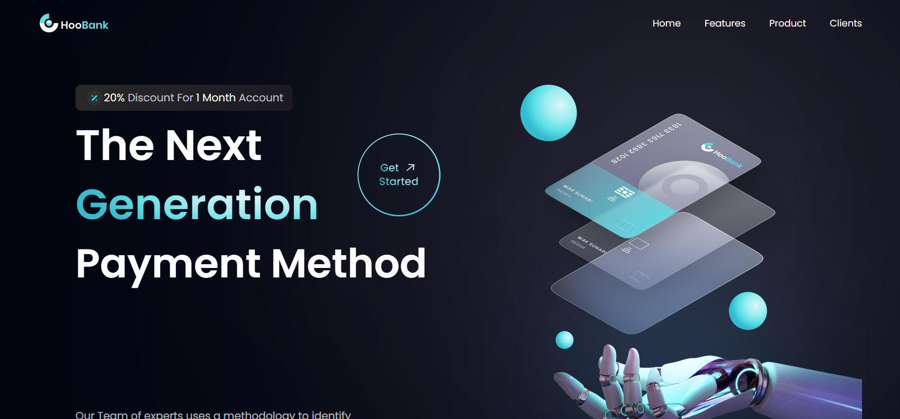
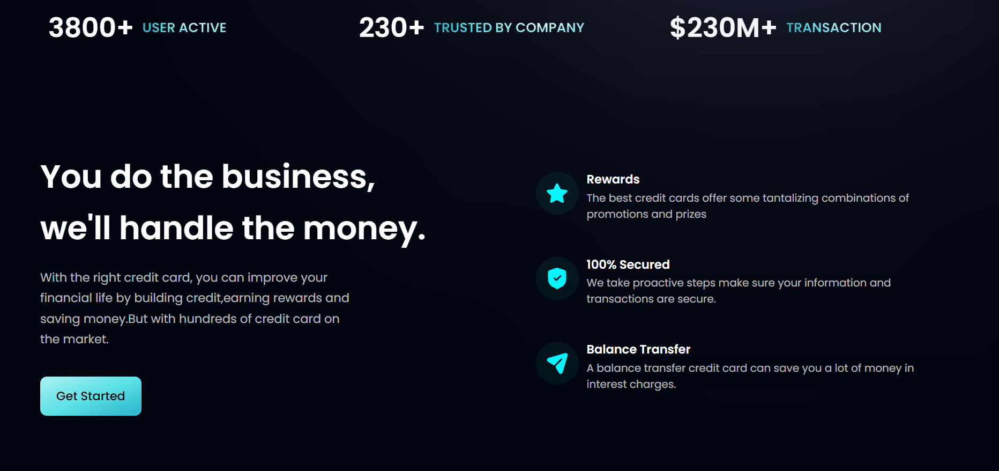
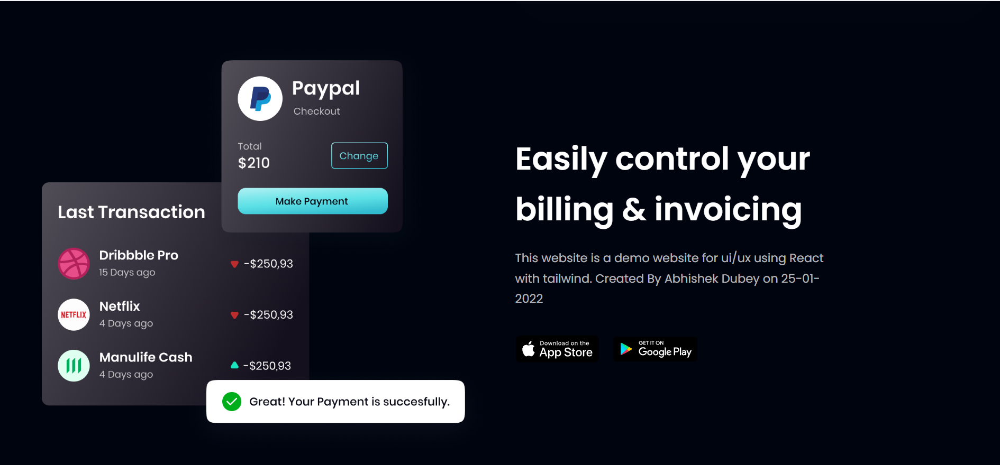
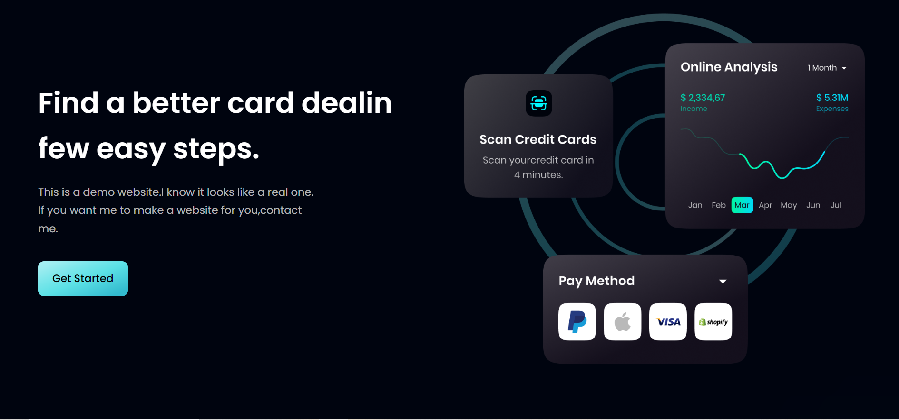
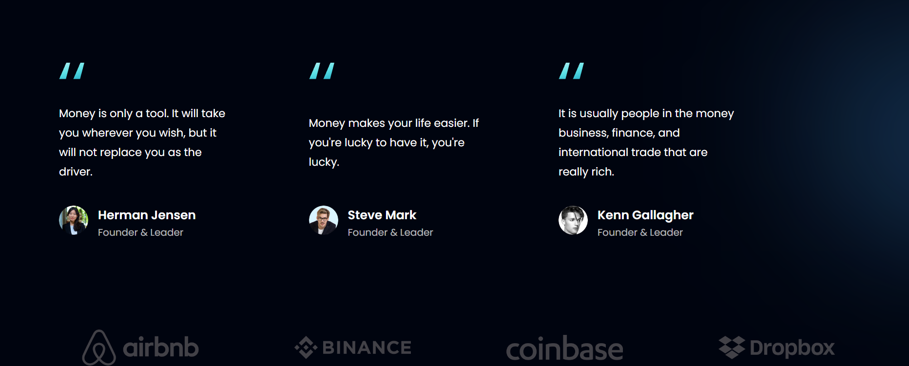
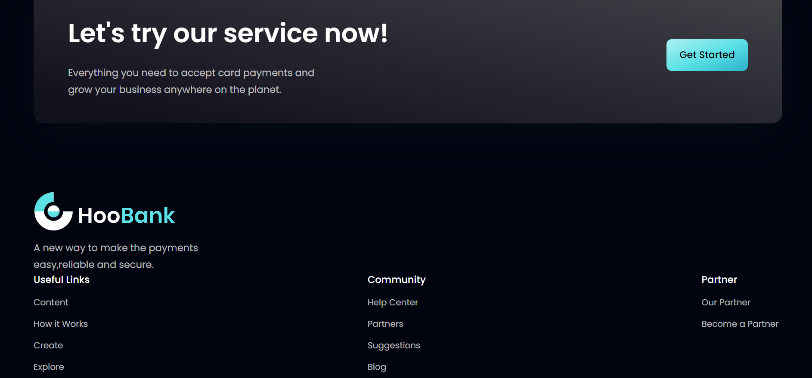

<h1 align="center" id="title">Modern UI/UX Website</h1>

<h2>🚀 Demo</h2>

[https://hoobankbyabhishek.netlify.app/](https://hoobankbyabhishek.netlify.app/)

<h2>Project Screenshots:</h2>

  
  
<h2>💻 Built with</h2>

Technologies used in the project:

*   React.js
*   Tailwind CSS
*   Vite

<h2>🛡️ License:</h2>

This project is licensed under the MIT License
